# Question 2 - behavioral cloning
## Question 2.2 - BC performance against expert
### Archtecture of the neurual net
- Normalization of inputs (aka Z-score) (rmk: std+=1e-6 to avoid divide by 0)
- 2 `Dense` hidden layer, `tanh` activation
- `Dense` output layer
- `Adam` optimizer, `batch_size=256`, `validation_split=10%`, `verbose=2`
- `Adam` hyperparams to be learnt and the default value `learning_rate=0.001`, `epochs=10` (this part for question 2.3)
- for each expert, `num_rollouts=20`
- for the neurual net, `num_rollouts=20`
- each rollout stop until `max_steps = env.spec.timestep_limit`

### behavioral cloning performance across all agent
| # | expert name | expert mean reward | expert std reward | BC mean reward | BC std reward |
| --- | --- | --- | --- | --- | --- |
| 0 | Ant-v2 | 4814.0965474080385 | 108.80632605584692 | 4406.201751455288 | 573.3854836162683 |
| 1 | HalfCheetah-v2 | 4127.516970772937 | 104.15206994425873 | 3513.893690862605 | 508.35242034980627 |
| 2 | Hopper-v2 | 3777.979019335801 | 3.7795498677440458 | 348.8571445834208 | 5.574347555130938 |
| 3 | Humanoid-v2 | 10398.817690139582 | 46.76945115242351 | 1398.7654248744934 | 662.1544824968952 |
| 4 | Reacher-v2 | -3.882463098485824 | 1.5836904717634293 | -10.895058170778515 | 4.211804026505475 |
| 5 | Walker2d-v2 | 5518.253465989686 | 45.763351643271314 | 5231.149197823615 | 1010.5542993232773 |

### comparable performance with expert
  Ant-v2         |      expert |   imitation
-----------------|-------------|------------
mean reward      |        4823 | 4776
std reward       |       87    | 92
pct full rollout |   100%      |  100%

### significant deviation from expert performance
  Reacher-v2         |      expert |   imitation
-----------------|-------------|------------
mean reward      |  -4.39  | -10.06
std reward       |   2.00     | 4.62
pct full rollout |   100%      |  100%

## Question 2.3 - BC sensitivity analysis to hyperparameters (Ant-v2 as example in this report)
### learning rate
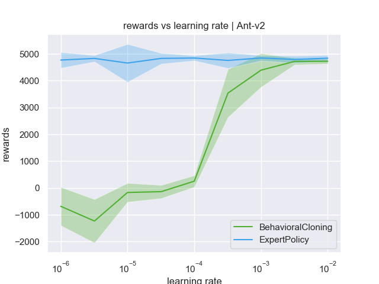

### training epochs
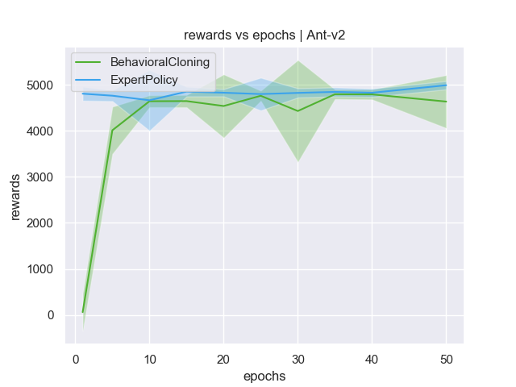

# Question 3 - DAgger
## Question 3.2 - DAgger performance against behavioral cloning (Reacher-v2 as example in this report)
### Architecture of the neural net
- Normalization of inputs (aka Z-score) (rmk: std+=1e-6 to avoid divide by 0)
- 2 `Dense` hidden layer, `tanh` activation
- `Dense` output layer
- `Adam` optimizer, `batch_size=256`, `validation_split=10%`, `verbose=2`, `learning_rate=0.001`, `epochs=10`
- for each expert, `num_rollouts=20`
- for the neurual net, `num_rollouts=20`
- each rollout stop until `max_steps = env.spec.timestep_limit`
- for the ietrations of DAgger, `iters=10`

### DAgger performs better than behavioral cloning
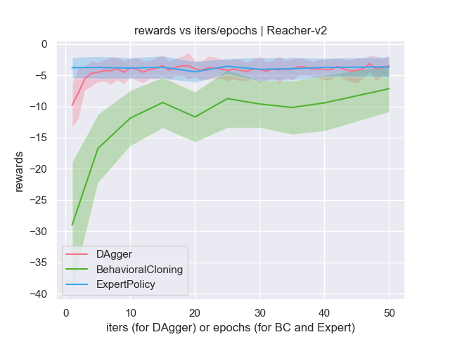

# Appendix
### BC hyperparams -- rewards vs learning rate

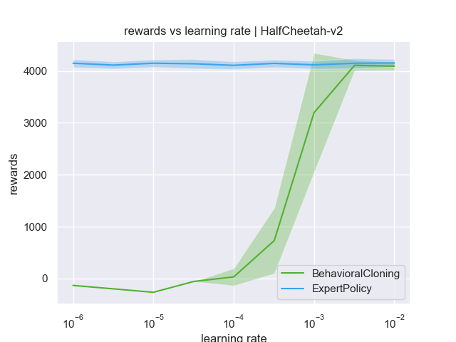

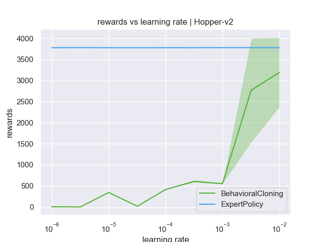

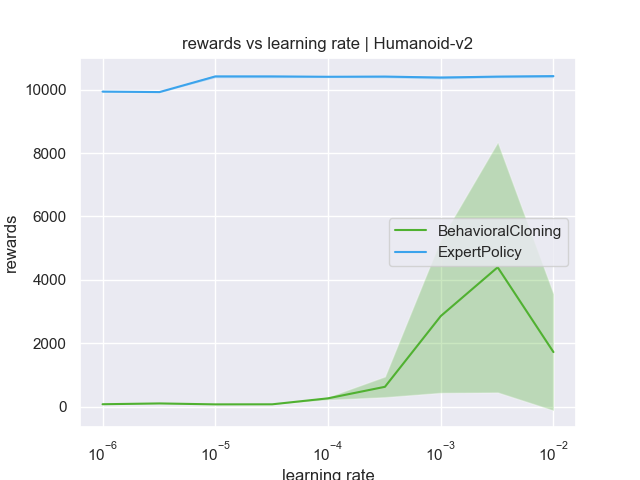

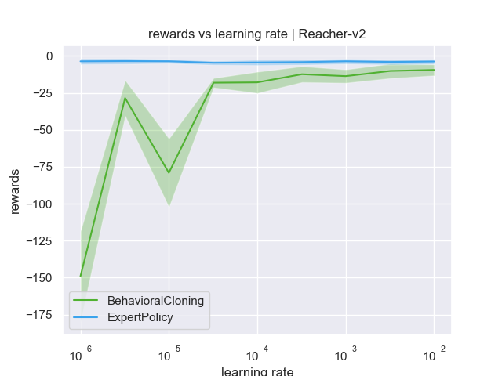

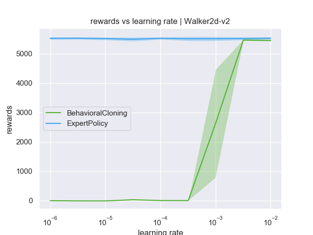

### BC hyperparams -- rewards vs epochs

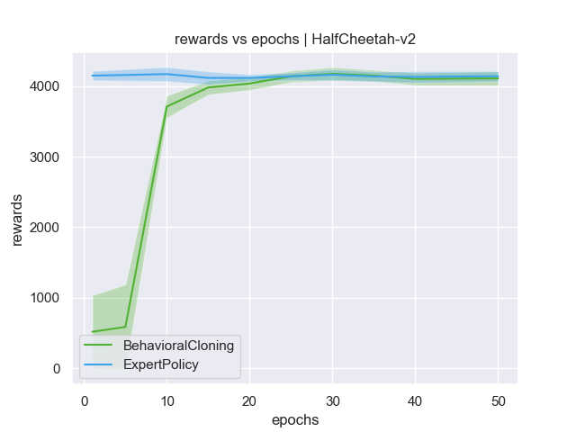

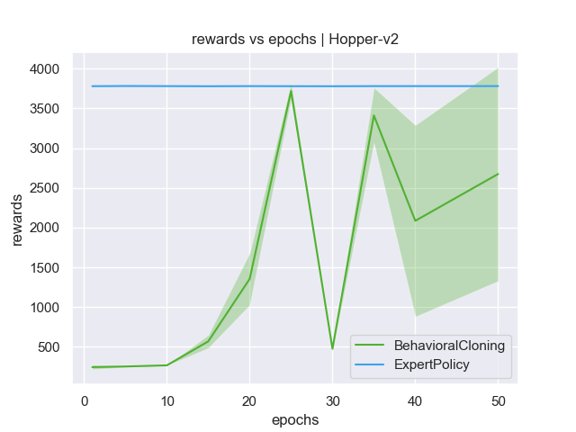

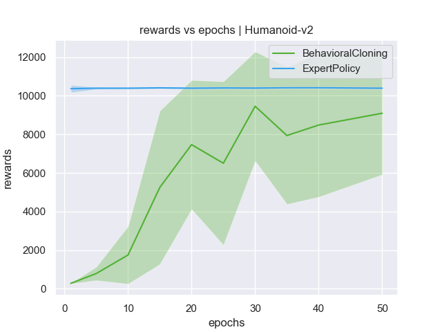

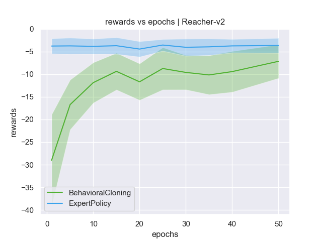

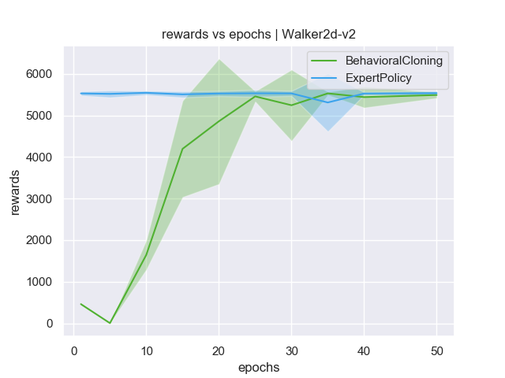

### Expert vs BC vs DAgger -- rewards vs iters -- 
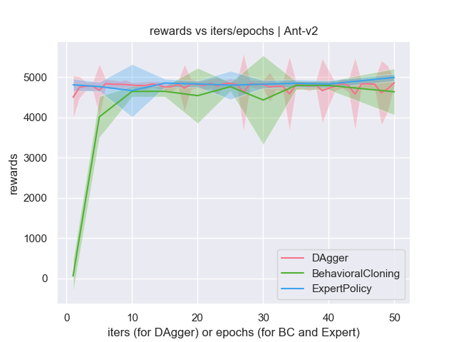

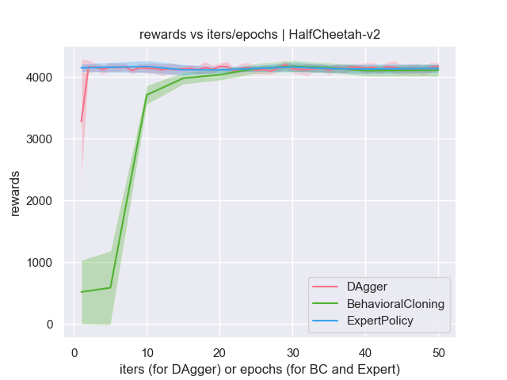

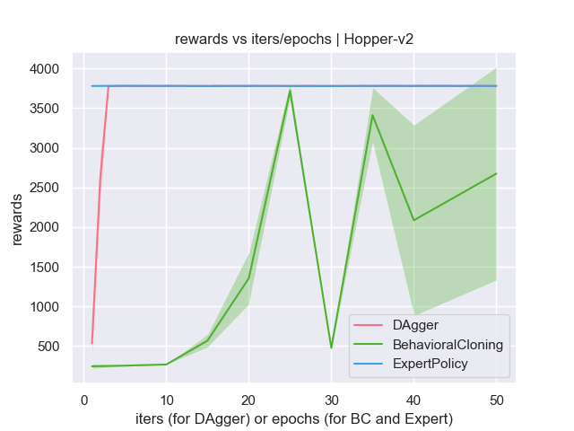

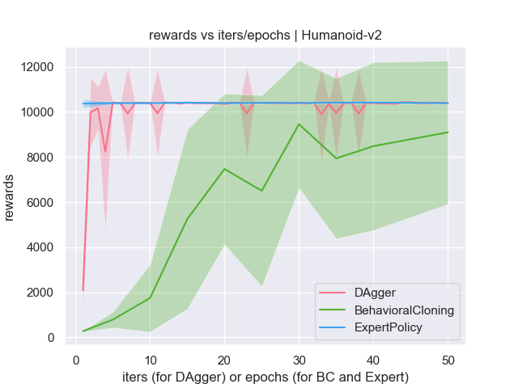

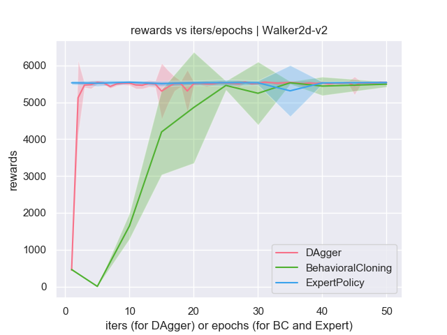
