# Problem 4 - CartPole
#### Graph the results
- In the first graph, compare the learning curves (average return at each iteration) for the experiments prefixed with sb_. (The small batch experiments.)
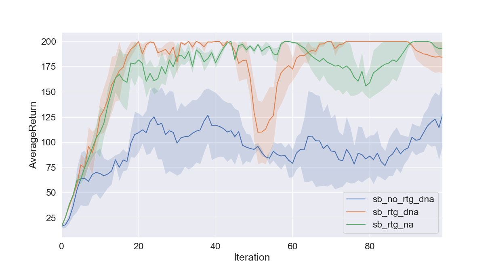

- In the second graph, compare the learning curves for the experiments prefixed with lb_. (The large batch experiments.)
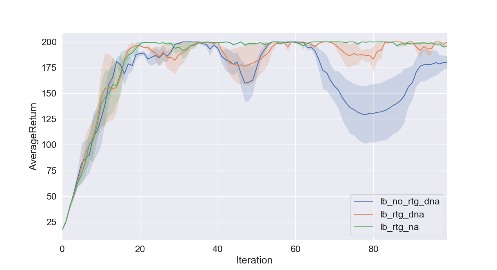

#### Answer the following questions briefly:
- Which gradient estimator has better performance without advantage-centering—the trajectory-centric one, or the one using reward-to-go?

In the first graph, the blue curve represents estimator without reward-to-go and advantage-centering; the red curve represents estimator without advantage-centering but with reward-to-go. The red learning curve indicates better learning for the reward-to-go estimator. 

- Did advantage centering help?

In the first graph, the red curve represents estimator without advantage-centering but with reward-to-go; the green curve represents estimator with advantage-centering and reward-to-go. The green learning curve indicates better learning for the advantage-centering estimator.

- Did the batch size make an impact?

The first graph represents training with small batch; the second graph represents training with large batch. In the second graph, all of the three learner can reach ideal reward-level (~200) and achieve lower variance, hence large batch size, in this case, is good for learning. 

#### Provide the exact command line configurations you used to run your experiments
Codes are include in `q4_main.bash`

`python train_pg_f18.py CartPole-v0 -n 100 -b 1000 -e 3 -dna --exp_name sb_no_rtg_dna`
`python train_pg_f18.py CartPole-v0 -n 100 -b 1000 -e 3 -rtg -dna --exp_name sb_rtg_dna`
`python train_pg_f18.py CartPole-v0 -n 100 -b 1000 -e 3 -rtg --exp_name sb_rtg_na`
`python train_pg_f18.py CartPole-v0 -n 100 -b 5000 -e 3 -dna --exp_name lb_no_rtg_dna`
`python train_pg_f18.py CartPole-v0 -n 100 -b 5000 -e 3 -rtg -dna --exp_name lb_rtg_dna`
`python train_pg_f18.py CartPole-v0 -n 100 -b 5000 -e 3 -rtg --exp_name lb_rtg_na`

`python plot.py data/sb_no_rtg_dna_CartPole-v0_12-09-2018_00-23-34 data/sb_rtg_dna_CartPole-v0_15-09-2018_19-28-58 data/sb_rtg_na_CartPole-v0_15-09-2018_19-44-28 --value AverageReturn`
`python plot.py data/lb_no_rtg_dna_CartPole-v0_15-09-2018_19-45-55 data/lb_rtg_dna_CartPole-v0_15-09-2018_19-52-24 data/lb_rtg_na_CartPole-v0_15-09-2018_19-57-13 --value AverageReturn`


# Problem 5 - Inverted Pendulum
#### Find the optimal b* and r*, plot the learning curve

The optimal `b*=500`, `r*=0.01 (or 0.02)`. The corresponding learning curve is
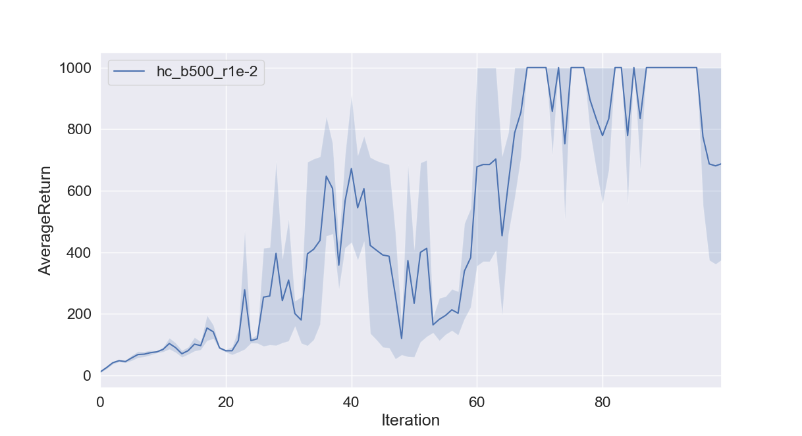

I have explored the `b=[100, 500, 1000, 3000, 5000]` and `lr=[2e-2, 1e-2, 5e-3, 1e-3, 1e-4]` and the learning curve under different learning rates are displayed below. I find that when `lr=1e-2`(last second figure), under all scenarios, the optimal value 1000 can be reached and in most cases, optimal value is reached in the first 50 iterations. When `batch_size=500`(corresponding to all purple curves), the 1000-reward can be reached earlier than `batch_size=100` and stay at the 1000 level. If we increase the batch size beyond 500, there is no significant improvement in the learning curve and sometimes the learner rewards fluctuate a lot from the 1000 level.

<center>`lr=1e-4` Learning Curve under Different Training Batches
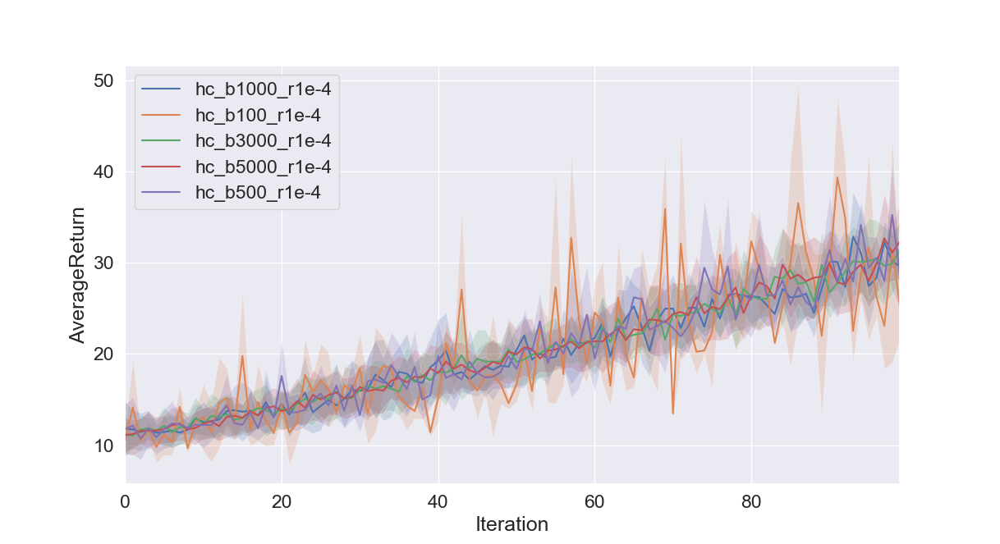
`lr=1e-3` Learning Curve under Different Training Batches
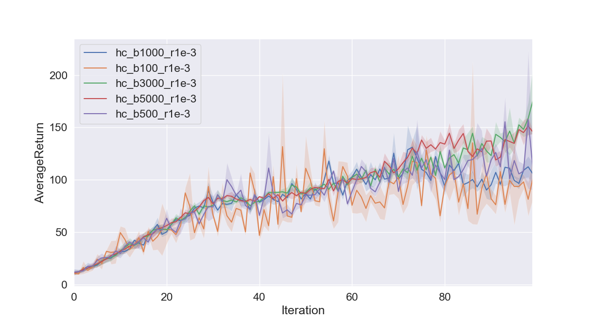
`lr=5e-3` Learning Curve under Different Training Batches
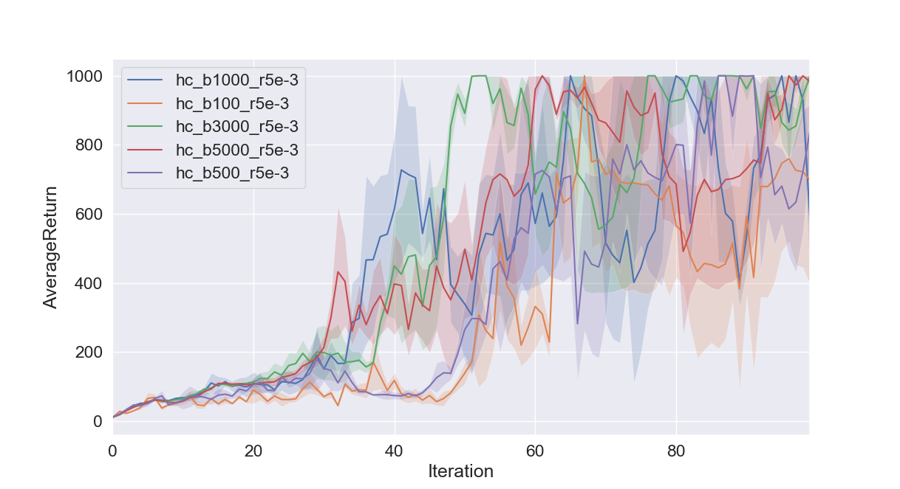
`lr=1e-2` Learning Curve under Different Training Batches
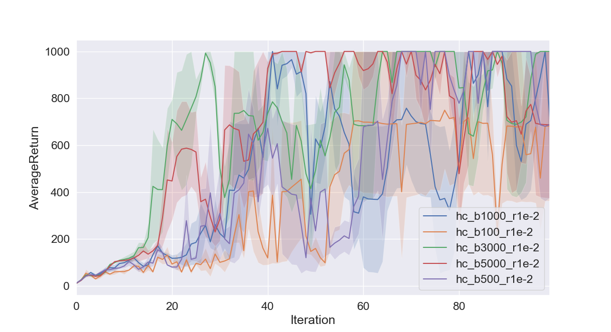
`lr=2e-2` Learning Curve under Different Training Batches
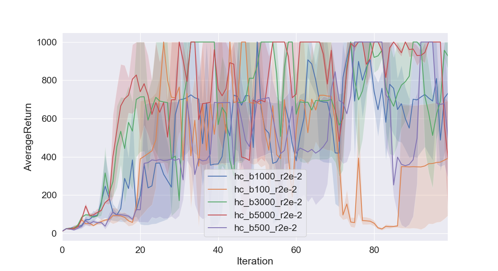</center>

#### Provide the exact command line configurations you used to run your experiments
Codes are include in `q5_main.bash`

```
for batch in 100 500 1000 3000 5000
do
	for lr in 2e-2 1e-2 5e-3 1e-3 1e-4
	do
		py train_pg_f18.py InvertedPendulum-v2 -ep 1000 --discount 0.9 -n 100 -e 3 -l 2 -s 64 -b $batch -lr $lr -rtg --exp_name hc_b${batch}_r${lr}
	done
done

py plot.py data/hc_b1000_r1e-2_InvertedPendulum-v2_16-09-2018_00-45-21 data/hc_b100_r1e-2_InvertedPendulum-v2_16-09-2018_00-33-44 data/hc_b3000_r1e-2_InvertedPendulum-v2_16-09-2018_00-54-45 data/hc_b5000_r1e-2_InvertedPendulum-v2_16-09-2018_01-11-36 data/hc_b500_r1e-2_InvertedPendulum-v2_16-09-2018_00-38-46 --value AverageReturn

py plot.py data/hc_b1000_r1e-3_InvertedPendulum-v2_16-09-2018_00-48-48 data/hc_b100_r1e-3_InvertedPendulum-v2_16-09-2018_00-35-48 data/hc_b3000_r1e-3_InvertedPendulum-v2_16-09-2018_01-00-40 data/hc_b5000_r1e-3_InvertedPendulum-v2_16-09-2018_01-26-49 data/hc_b500_r1e-3_InvertedPendulum-v2_16-09-2018_00-41-37 --value AverageReturn

py plot.py data/hc_b1000_r1e-4_InvertedPendulum-v2_16-09-2018_00-50-12 data/hc_b100_r1e-4_InvertedPendulum-v2_16-09-2018_00-36-35 data/hc_b3000_r1e-4_InvertedPendulum-v2_16-09-2018_01-03-28 data/hc_b5000_r1e-4_InvertedPendulum-v2_16-09-2018_01-35-03 data/hc_b500_r1e-4_InvertedPendulum-v2_16-09-2018_00-42-33 --value AverageReturn

py plot.py data/hc_b1000_r2e-2_InvertedPendulum-v2_16-09-2018_00-43-32 data/hc_b100_r2e-2_InvertedPendulum-v2_16-09-2018_00-32-34 data/hc_b3000_r2e-2_InvertedPendulum-v2_16-09-2018_00-51-39 data/hc_b5000_r2e-2_InvertedPendulum-v2_16-09-2018_01-06-47 data/hc_b500_r2e-2_InvertedPendulum-v2_16-09-2018_00-37-17 --value AverageReturn

py plot.py data/hc_b1000_r5e-3_InvertedPendulum-v2_16-09-2018_00-47-05 data/hc_b100_r5e-3_InvertedPendulum-v2_16-09-2018_00-34-49 data/hc_b3000_r5e-3_InvertedPendulum-v2_16-09-2018_00-57-44 data/hc_b5000_r5e-3_InvertedPendulum-v2_16-09-2018_01-17-25 data/hc_b500_r5e-3_InvertedPendulum-v2_16-09-2018_00-40-14 --value AverageReturn

py plot.py data/hc_b500_r1e-2_InvertedPendulum-v2_16-09-2018_00-38-46 --value AverageReturn
```

# Problem 7 - Lunar Lander
#### Graph the learning curve
The learning curve for the configuration specified by homwork is
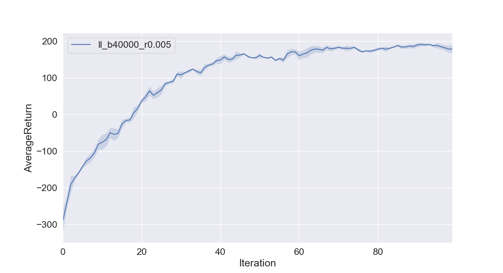

#### Provide the exact command line configurations you used to run your experiments
Codes are include in `q7_main.bash`

`python train_pg_f18.py LunarLanderContinuous-v2 -ep 1000 --discount 0.99 -n 100 -e 3 -l 2 -s 64 -b 40000 -lr 0.005 -rtg --nn_baseline --exp_name ll_b40000_r0.005`

`python plot.py data/ll_b40000_r0.005_LunarLanderContinuous-v2_15-09-2018_21-41-36 --value AverageReturn`

# Problem 8 - HalfCheetah
#### How did the batch size and learning rate affect the performance?
The learning curves under different batches and learning rates are plotted. From 10000 to 50000, as the batch size increases, the learning curve reaches better results. With different batch sizes, the learning rates have different influence on the learning performance. 

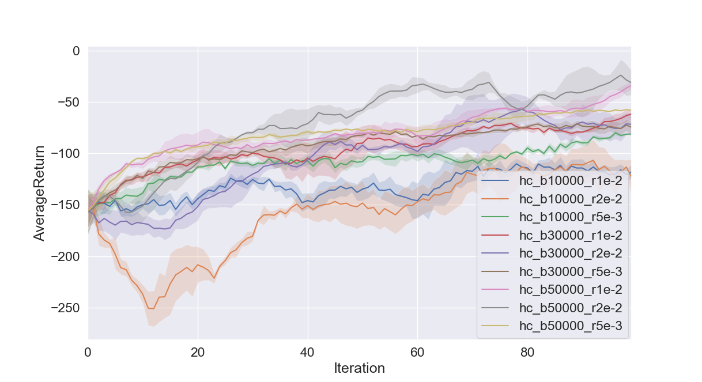

#### Find the optimal b* and r* and run the following commands
We can see that the optimal `b*=50000` and `r*=2e-2`

Results `py train_pg_f18.py HalfCheetah-v2 -ep 150 --discount 0.95 -n 100 -e 3 -l 2 -s 32 -b <b*> -lr <r*> --exp_name hc_b<b*>_r<r*>`
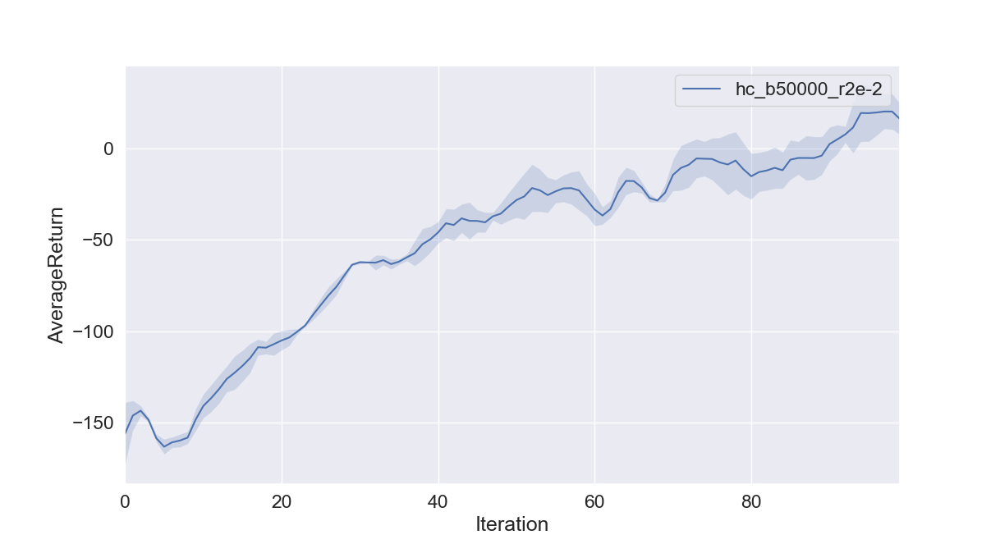

Results with reward-to-go `py train_pg_f18.py HalfCheetah-v2 -ep 150 --discount 0.95 -n 100 -e 3 -l 2 -s 32 -b <b*> -lr <r*> -rtg --exp_name hc_b<b*>_r<r*>`
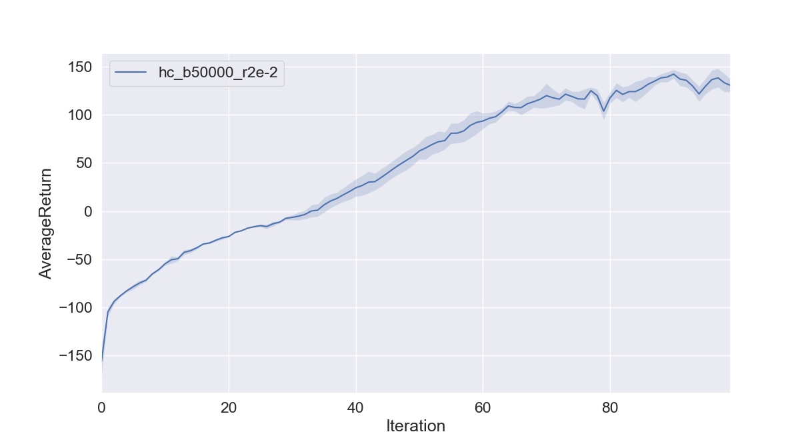

Results with baseline `py train_pg_f18.py HalfCheetah-v2 -ep 150 --discount 0.95 -n 100 -e 3 -l 2 -s 32 -b <b*> -lr <r*> --nn_baseline --exp_name hc_b<b*>_r<r*>`
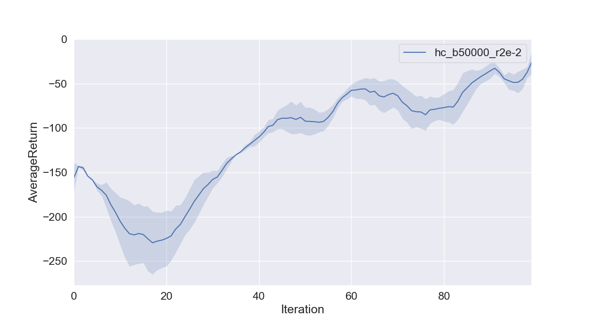

Results with reward-to-go and baseline `py train_pg_f18.py HalfCheetah-v2 -ep 150 --discount 0.9 -n 100 -e 3 -l 2 -s 32 -b <b*> -lr <r*> -rtg --nn_baseline --exp_name hc_b<b*>_r<r*>`
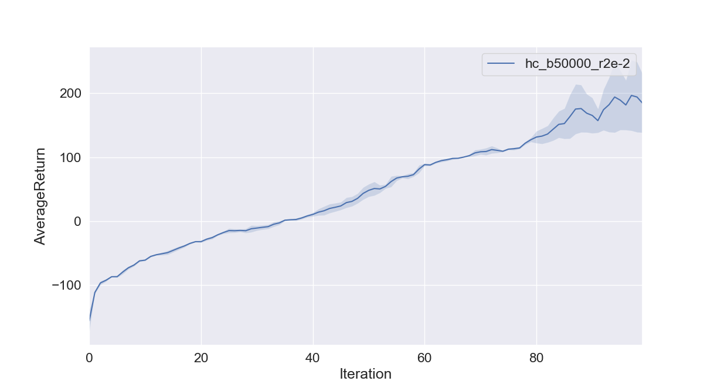

#### Provide the exact command line configurations you used to run your experiments
Codes are include in `q8_main.bash`

```
for batch in 10000 30000 50000
do
	for lr in 2e-2 1e-2 5e-3
	do
		py train_pg_f18.py HalfCheetah-v2 -ep 150 --discount 0.9 -n 100 -e 3 -l 2 -s 32 -b $batch -lr $lr --exp_name hc_b${batch}_r${lr}
	done
done
```

# Bonus Question - Implementation of GAE_lambda
#### Learning performance comparison of 
- Learner 1: with baseline and reward to go
- Learner 2: with bl, rtg and GAE with `lambda=0.9`
- Learner 3: with bl, rtg and GAE with `lambda=0.99`


Details see file `train_pg_f18.py` line 501-line 516. 

Trained date one `batch_size=[5000, 50000]`, `learning_rate=[1e-2, 2e-2]` and `nn_size=[32, 64]` have been tested out and the resulting images are in folder `data`.
The results for `batch_size=5000`, `learning_rate=2e-2` and `nn_size=32` are displayed.
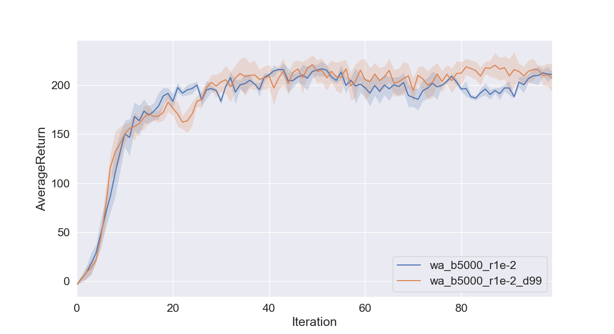
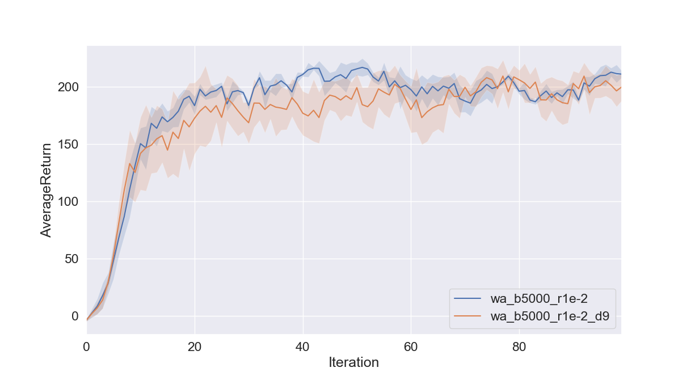


#### Provide the exact command line configurations you used to run your experiments
Codes are include in `gae_main.bash`

# Overview of the Architecture && Computational Graph
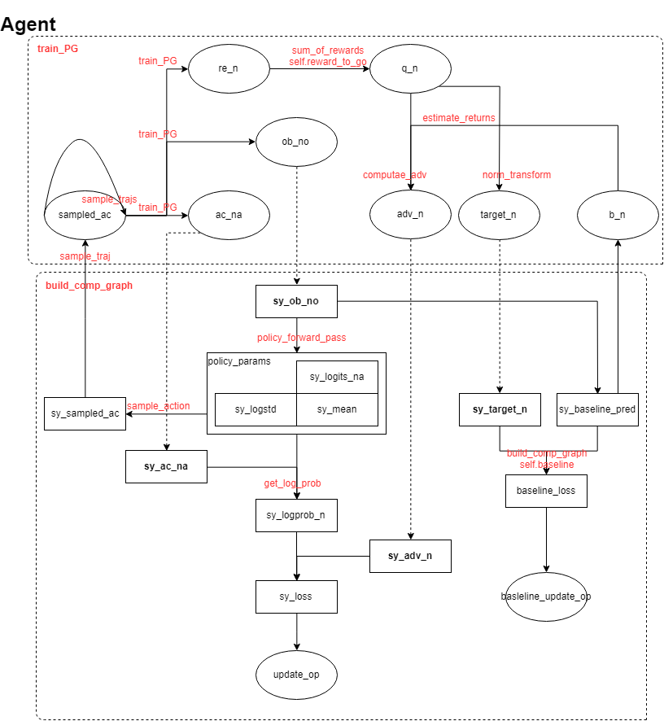