# Part 1: Q-Learning
## Question 1 - basic Q-learning performance
#### Include a learning curve plot showing the performance of your implementation on the game Pong.
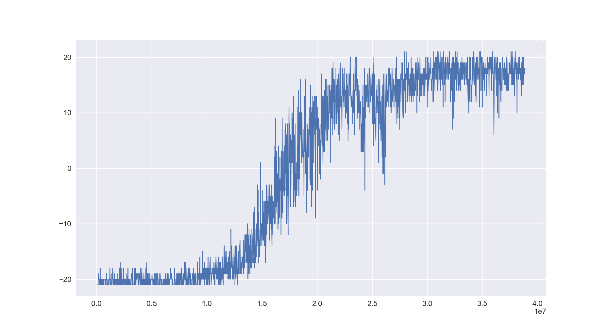

## Question 2 - double Q-learning
#### Compare the performance of double DQN to vanilla DQN.
- We can see that, especially after 1.5m steps, double-Q learner learns slightly faster (according to the log, ~200,000 faster than the DQN learner) and reaches reward 20 earlier than DQN leaner.
- With Double Q
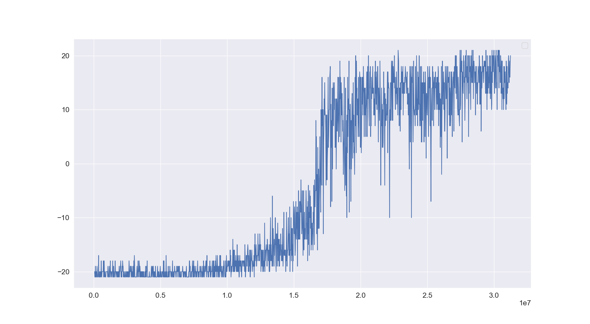
- Without Double Q (DQN, first 3m timesteps)
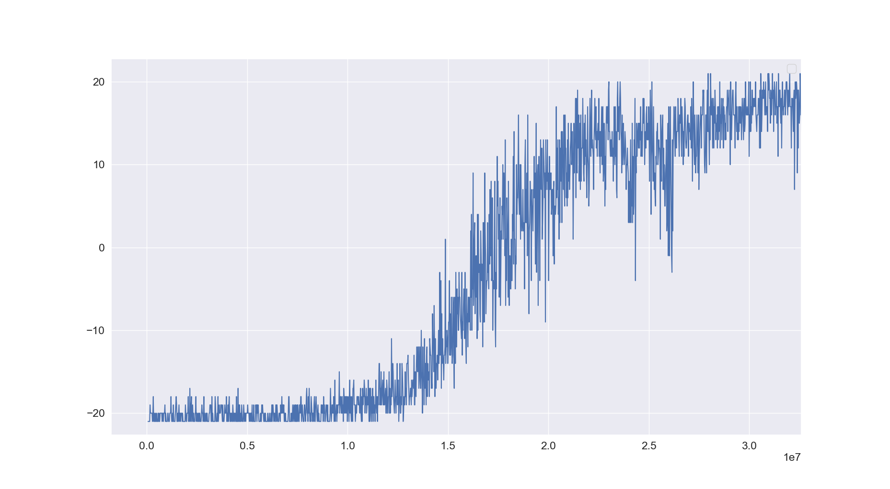

## Question 3 - experimenting with hyperparamsters
#### Choose one hyperparameter of your choice and run at least three other settings of this hyperparameter, in addition to the one used in Question 1, and plot all four values on the same graph.
- `gamma=0.8`, `gamma=0.9`, `gamma=0.95`, `gamma=0.97`, `gamma=0.99`
- Gamma = 0.8
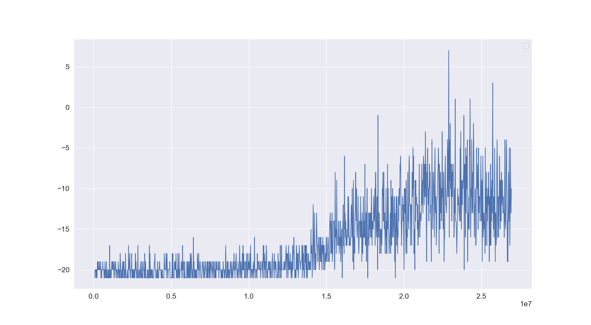
- Gamma = 0.9
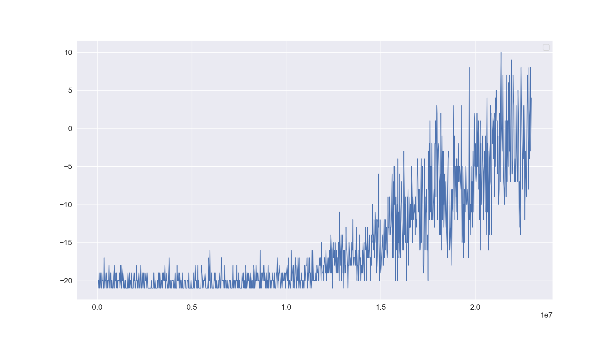
- Gamma = 0.95
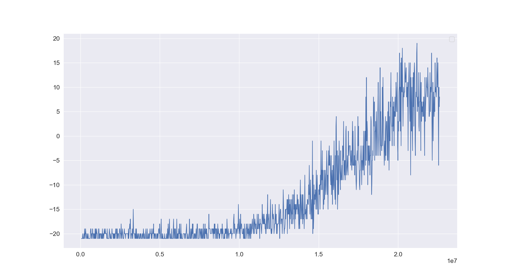
- Gamma = 0.97
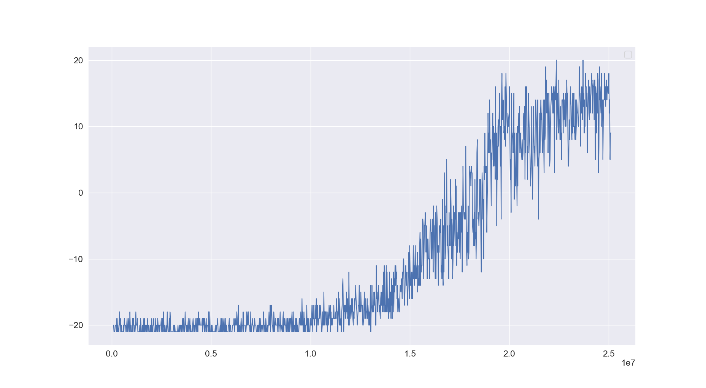
- Gamma = 0.99
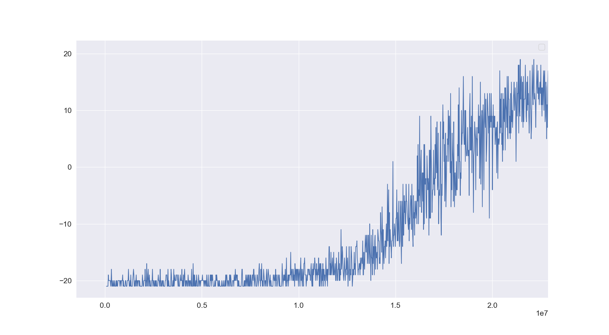
- All in one, [red: 0.97, green:0.95, orange: 0.9, blue:0.8]
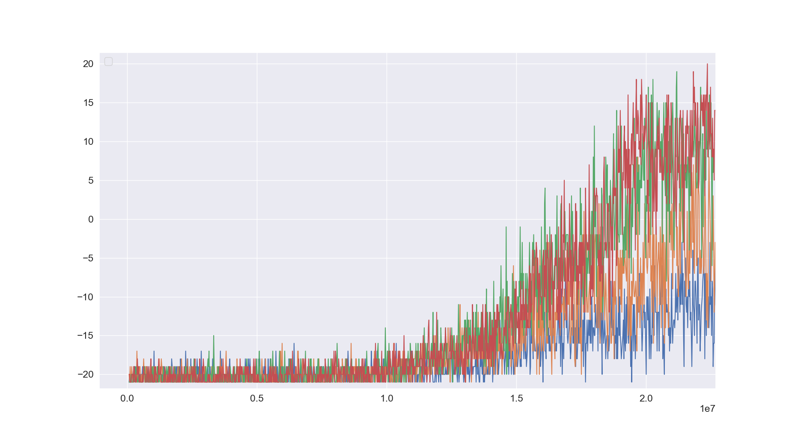

# Part 2: Actor-Critic
## Question 1 - Sanity check with Cartpole
#### Compare the results for the following settings and report which worked best. Provide a short explanation for your results.
`python train_ac_f18.py CartPole-v0 -n 100 -b 1000 -e 3 --exp_name 1_1 -ntu 1 -ngsptu 1`
`python train_ac_f18.py CartPole-v0 -n 100 -b 1000 -e 3 --exp_name 100_1 -ntu 100 -ngsptu 1`
`python train_ac_f18.py CartPole-v0 -n 100 -b 1000 -e 3 --exp_name 1_100 -ntu 1 -ngsptu 100`
`python train_ac_f18.py CartPole-v0 -n 100 -b 1000 -e 3 --exp_name 10_10 -ntu 10 -ngsptu 10`

- The results
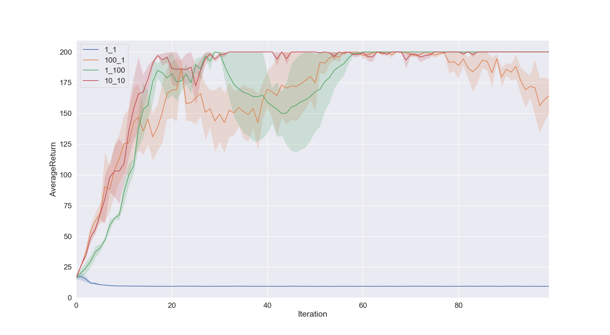

## Question 2 - Run actor-critic with more difficult tasks
#### Use the best setting from the previous question to run InvertedPendulum and HalfCheetah.
`python train_ac_f18.py InvertedPendulum-v2 -ep 1000 --discount 0.95 -n 100 -e 3 -l 2 -s 64 -b 5000 -lr 0.01 --exp_name 10_10 -ntu 10 -ngsptu 10`
`python train_ac_f18.py HalfCheetah-v2 -ep 150 --discount 0.90 -n 100 -e 3 -l 2 -s 32 -b 30000 -lr 0.02 --exp_name 10_10 -ntu 10 -ngsptu 10`
- The results :
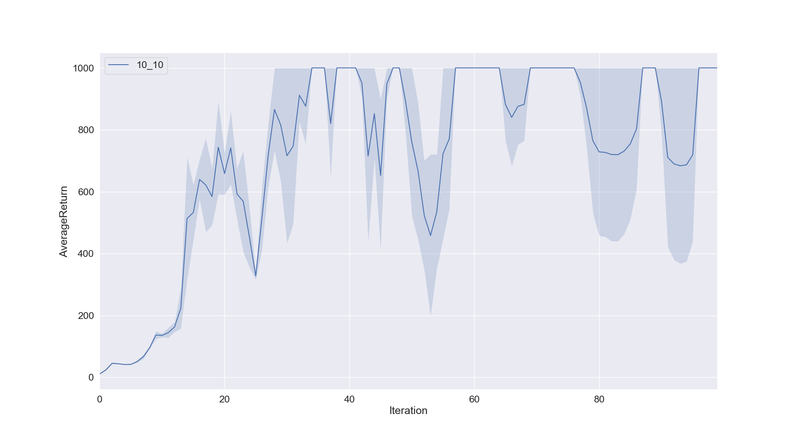
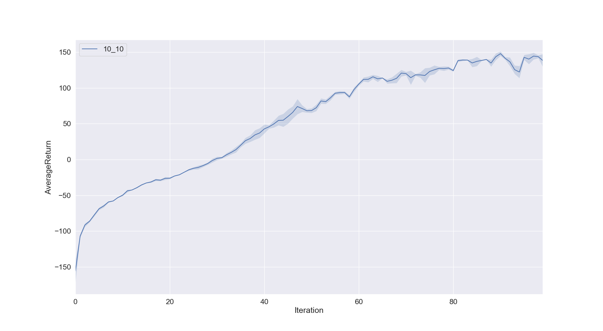
