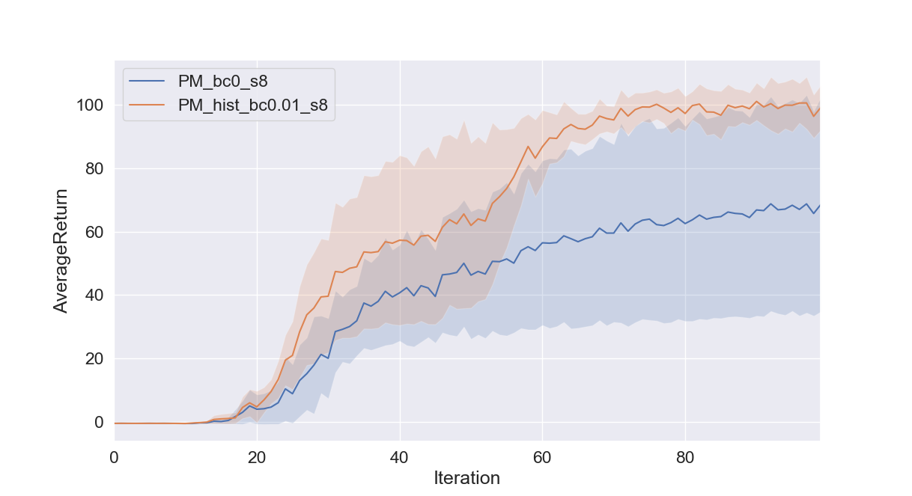

# Advanced Exploration
## Problem 1 - Hist Exploration
#### The reward modification (Eqn. 1), the count-based reward bonus (Eqn. 2), and the histogram density model
- A plot with 2 curves comparing an agent with histogrambased exploration and an agent with no exploration

## Problem 2 - RBF Exploration
#### The heuristic reward bonus (Eqn. 2), and the kernel density estimator with the radial basis function kernel.
- A plot with 2 curves comparing an agent with KDEbased exploration and an agent with no exploration

## Problem 3 - EX2 Exploration
- A plot with 2 curves comparing an agent with EX2-based exploration and an agent with no exploration

## Problem 4 - EX2 Exploration, Hyper-params
- A plot with 3 curves comparing the agents with EX2-based exploration and an agent with no exploration

### Short answer: 
- The average return peaks at the middle for both EX2 exploration. 
- The learning is better with parameter `bc = 0.0001`

